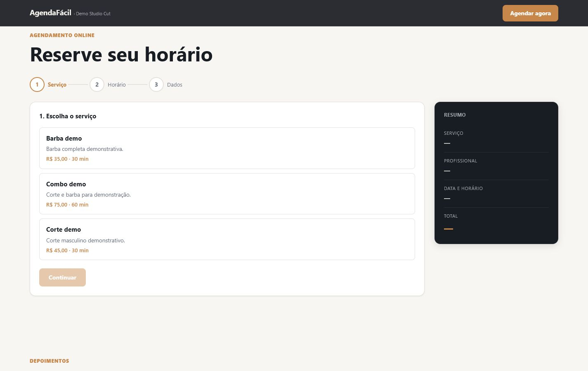
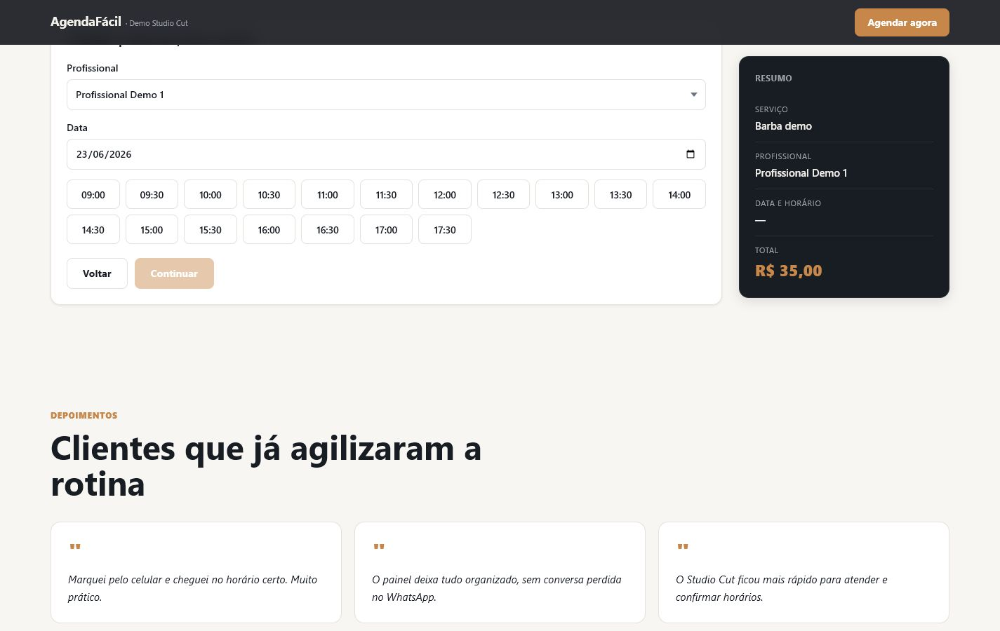
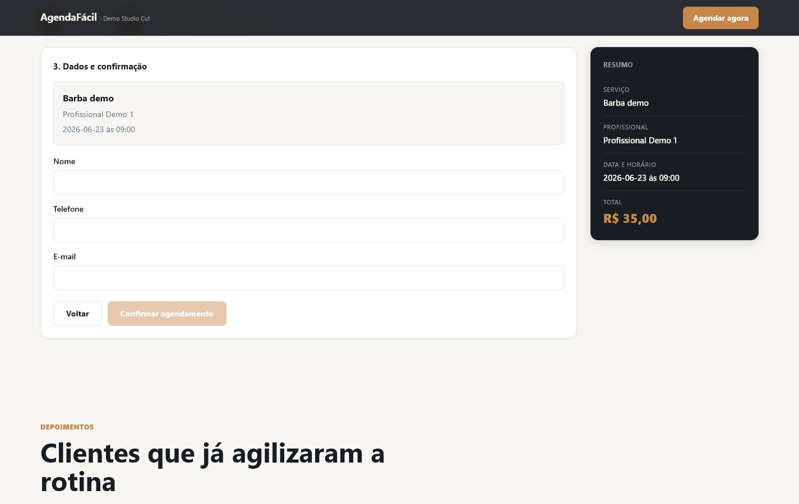
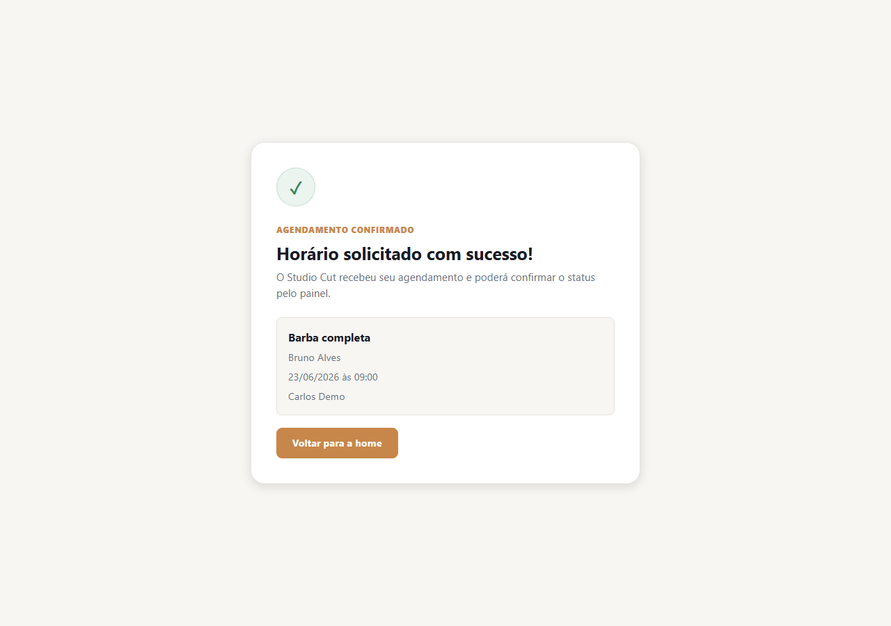
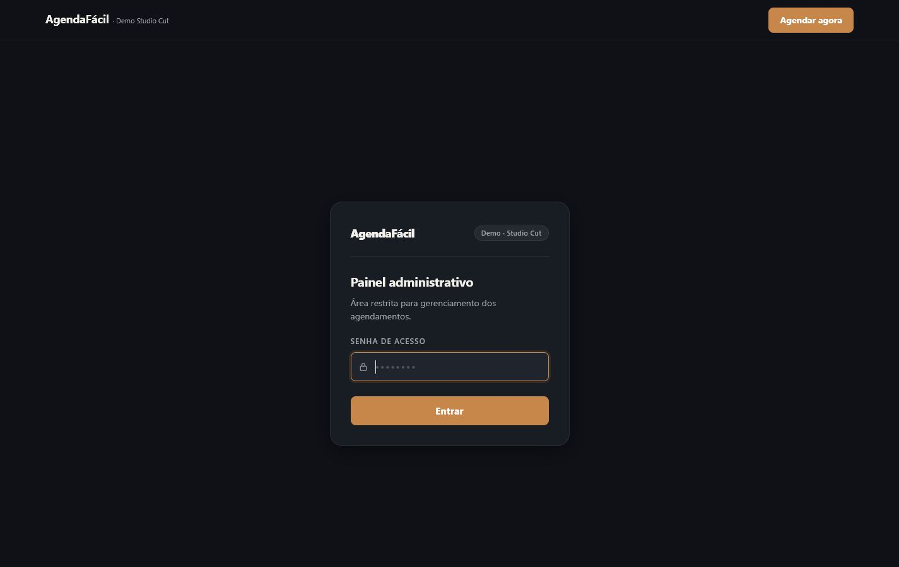
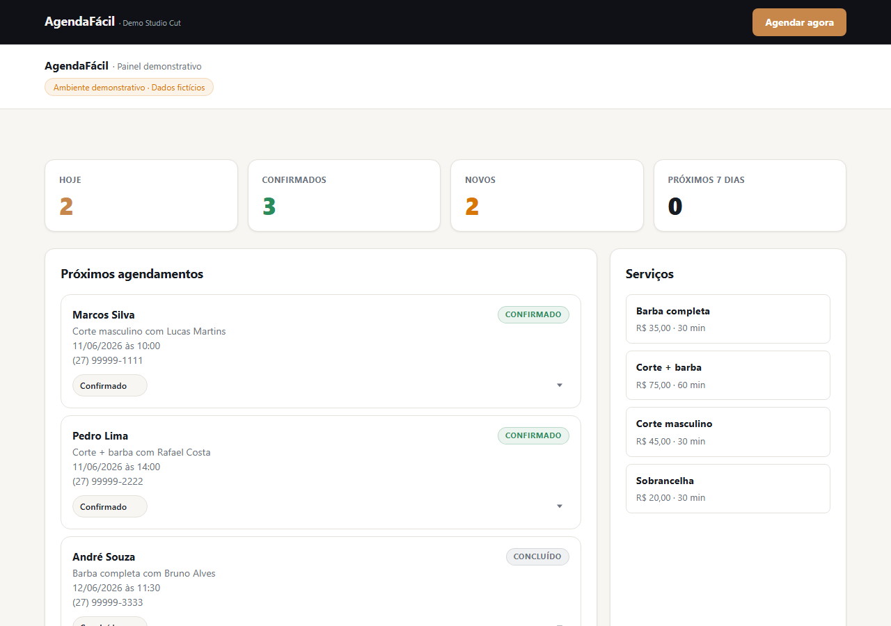
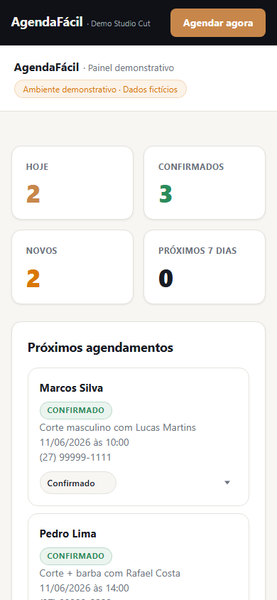

# AgendaFacil

Sistema full stack de agendamento online para pequenos negocios de servico. A demonstracao usa a marca ficticia Studio Cut, onde o cliente escolhe servico, profissional, data e horario, e a empresa acompanha tudo em um painel administrativo.

[Demo publica](https://agendafacil-sistema.vercel.app)  
[Painel admin](https://agendafacil-sistema.vercel.app/admin)  
[Repositorio](https://github.com/RhanielRodri/agendafacil-sistema)

> O painel admin usa a senha configurada em `ADMIN_SECRET`. Nao existe senha real versionada no repositorio.

## Screenshots

### Home desktop


### Home mobile


### Escolha de servico


### Escolha de horario


### Formulario de agendamento


### Confirmacao


### Login admin


### Dashboard admin


### Admin mobile


## Funcionalidades

- Home publica responsiva com servicos, profissionais e chamada para agendamento.
- Fluxo de agendamento em etapas: servico, profissional, data, horario e dados do cliente.
- Consulta de horarios disponiveis em tempo real.
- Confirmacao visual do agendamento solicitado.
- Painel administrativo protegido por sessao em cookie httpOnly.
- Dashboard com metricas, lista de agendamentos e alteracao de status.
- API com validacoes de regra de negocio e bloqueio de horarios concorrentes.

## Stack

- Frontend: React, Vite e CSS puro.
- Backend: Node.js, Express e Prisma.
- Banco: PostgreSQL.
- Deploy: Vercel no frontend e Render no backend.

## Seguranca

- Senha administrativa somente por variavel de ambiente.
- Sessao admin em cookie httpOnly.
- Rate limit na criacao de agendamentos.
- Regras de conflito protegidas por transacao e constraint no banco.
- Seed bloqueado em producao.
- `.env` nao deve ser versionado.

## Como rodar localmente

### Backend

```powershell
cd backend
npm.cmd install
Copy-Item .env.example .env
npm.cmd run prisma:generate
npm.cmd run prisma:migrate
npm.cmd run prisma:seed
npm.cmd run dev
```

A API roda por padrao em:

```text
http://localhost:4000/api
```

### Frontend

```powershell
cd frontend
npm.cmd install
Copy-Item .env.example .env
npm.cmd run dev
```

O frontend roda por padrao em:

```text
http://localhost:5173
```

## Variaveis de ambiente

### Backend

```env
DATABASE_URL=
PORT=
FRONTEND_URL=
NODE_ENV=
ADMIN_SECRET=
```

### Frontend

```env
VITE_API_URL=
```

Use valores reais apenas nos arquivos `.env` locais ou nos paineis da Vercel/Render.

## Deploy

- Frontend: Vercel, com root directory `frontend`.
- Backend: Render, usando `render.yaml` na raiz.
- Banco: PostgreSQL no Render.
- API publicada: `https://agendafacil-api-5zxc.onrender.com/api`
- Health check: `https://agendafacil-api-5zxc.onrender.com/api/health`

## O que este projeto demonstra

- **Transação Prisma serializada** para evitar double-booking: dois clientes no mesmo horário são bloqueados em nível de banco, não só de aplicação
- **Rate limit implementado do zero** no Express, sem dependência externa, controlado por IP e janela de tempo
- **Fluxo multi-step com estado gerenciado** em React: serviço → profissional → data → horário → dados → confirmação, com validação em cada etapa
- **API REST com validação completa de payload**: campos obrigatórios, formatos, regras de negócio (horário disponível, data no futuro, serviço ativo)
- **Deploy separado frontend/backend**: Vercel + Render com variáveis de ambiente distintas por ambiente

## Autor

Desenvolvido por Rhaniel Rodrigues.

GitHub: https://github.com/RhanielRodri
